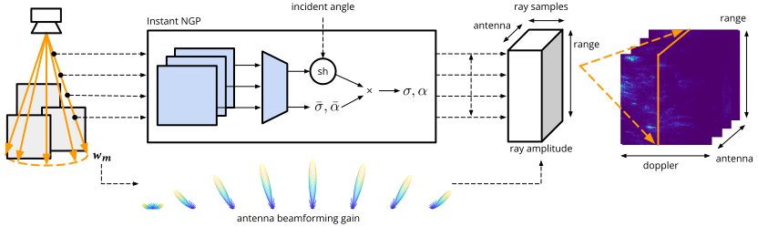

# DART: Doppler-Aided Radar Tomography

Implementation of *DART: Implicit Doppler Tomography for Radar Mapping and Novel View Synthesis*



## Setup

0. Ensure that you have python (`>=3.8`), CUDA (`>=11.8`), and CUDNN.

1. Install [jax](https://github.com/google/jax). Note that you will need to manually install jax-gpu to match the cuda version:
    ```sh
    pip install --upgrade "jax[cuda11_local]" -f https://storage.googleapis.com/jax-releases/jax_cuda_releases.html
    ```
    for CUDA 11.x.

    **NOTE**: jax is not included in `requirements.txt` due to requiring CUDA-dependent manual installation.

2. Install `libhdf5`:
    ```sh
    sudo apt-get -y install libhdf5-dev
    ```

3. Install python dependencies:
    ```sh
    pip install -r requirements.txt
    ```
    - Use Python 3.11, CUDA 11.8, Jax 0.4.10, and ```pip install -r requirements-pinned.txt``` to get the exact version of dependencies that we used.

4. Prepare datasets.
    - If downloading our [datasets](docs/datasets.md), you will need to create a formatted dataset (`data.h5`) for training:
        ```sh
        python manage.py dataset -p data/path/to/dataset
        ```
    - The dataset format is also documented on the [datasets](docs/datasets.md) page.

## Usage

TL;DR:
```sh
TARGET=output DATASET=lab-1 make experiment
```

With arguments:
```sh
TARGET=output METHOD=ngp DATASET=lab-1 FLAGS="---epochs 5" make experiment
```

- `METHOD=ngp`: model to train (`ngp`, `ngpsh`, `ngpsh2`, `grid`).
- `DATASET=path/to/dataset`: dataset to use, organized as follows:
    ```sh
    data/path/to/dataset/
        sensor.json             # Sensor configuration file
        data.h5                 # Data file with pose and range-doppler images.
    ```
    *Note*: `sensor.json` and `data.h5` can also be specified by `-s path/to/dataset.json` and `-p path/to/data.h5`.
- `TARGET=path/to/output`: save results (checkpoints, evaluation, and configuration) to `results/path/to/output`.
- `FLAGS=...`: arguments to pass to `train.py`; see `python train.py -h` and `python train.py ngpsh -h`, replacing `ngpsh` with the target method.

This creates the following files in `results/output`:
```sh
results/
    output/
        metadata.json       # Model/dataset/training metadata
        model.chkpt         # Model weights checkpoint
        pred.h5             # Predicted range-doppler images
        cam.h5              # Virtual camera renderings for the trajectory
        map.h5              # Map of the scene sampled at 25 units/meter
        output.video.mp4    # Output camera + radar video
        output.map.mp4      # Video where each frame is a horizontal slice
    ...
```

Multiple models on the same trajectory can also be combined into a single output video:
```sh
python manage.py video -p results/output results/output2 ... -f 30 -s 512 -o results/video.mp4
```

## Available Commands

See `-h` for each command/subcommand for more details.

`train.py`: train model; each subcommand is a different model class.
- `grid`: plenoxels-style grid.
- `ngp`: non-view-dependent NGP-style neural hash grid.
- `ngpsh`: NGP-style neural hash with plenoctrees-style view dependence (what DART uses).
- `ngpsh2`: NGP-style neural hash with nerfacto-style view dependence.

`manage.py`: evaluation and visualization tools:
- `simulate`: create simulated dataset from a ground truth reflectance grid (e.g. the `map.npz` file obtained from LIDAR.)
- `evaluate`: apply model to all poses in the trace, saving the result to disk. Can't be the same program as `train.py` due to vram limitations - need to completely free training memory allocation before running evaluate.
- `video`: create video from radar and "camera" frames; need to run `evaluate -a` and `evaluate -ac` first.
- `map`: evaluate DART model in a grid.
- `slice`: render MRI-style tomographic slices, and write each slice to a frame in a video; need to run `map` first.
- `metrics`: compute validation-set SSIM for range-doppler-azimuth images.
- `compare`: create a side-by-side video comparison of different methods (and/or ground truth).
- `dataset`: create a filtered train/val.
- `psnr`: calculate reference PSNR for gaussian noise.
